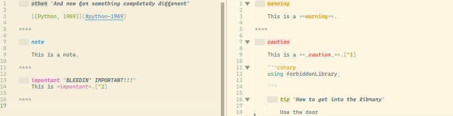

# Everforest theme for Sublime Text

This theme is forked from @a-n-d-a-i's Sublime Text conversion ([found here](https://github.com/a-n-d-a-i/everforest-sublime "everforest-sublime")) of @sainnhe's everforest theme orignally for VS Code [found here](https://github.com/sainnhe/everforest/ "everforest").

I use Sublime Text to work on markdown documents and I was missing syntax highlighting. I love the solarized themes and the colour green so when I stumbled on everforest I went for a stroll and came back with some more extensive highlighting:

Since MarkdownEditing recently added support for Python admonitions (used in python markdown, MarkdownPreview's default parser), I also added highlighting for that (as of this writing the scope specifically for admonition names have been merged but not released):

## Installation

WIP...

For now copying the two sublime.color-scheme files and pasting them into your user folder in your Sublime Text installation will work.

## Original README for prosperity

Original: https://github.com/sainnhe/everforest/

Converted from VSCode version https://github.com/sainnhe/everforest-vscode 

Converted with https://github.com/tobiastimm/code-theme-converter
